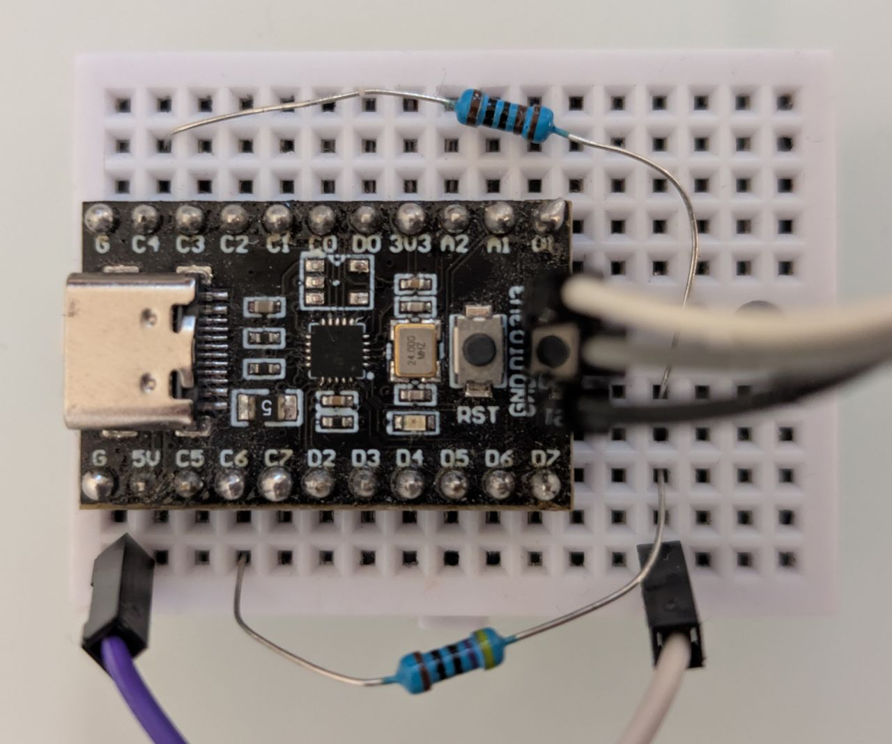

# V003 Home Computer

`V003 Home Computer` turns a `CH32V003` into a tiny monochrome PAL text machine
with a built-in line-numbered BASIC interpreter. Video is generated directly by
the MCU, and keyboard input can be controlled with the `ch32fun` single-wire monitor.

This is a toy / proof-of-concept.

Credits to similar projects:
- [Olimex RVPC](https://github.com/OLIMEX/RVPC)
- [Lucas Hartmann ch32v003_cvbs](https://github.com/lhartmann/ch32v003_cvbs)

## Demo Videos

### General BASIC demo

https://github.com/user-attachments/assets/b10c93e7-f365-4a17-907d-5192cda7ffc1

## Hardware

<p align="center">
  
</p>

The video output is a simple 2-resistor passive DAC into a standard `75 ohm`
composite input.
- `PC4` -> `1.0 kohm` -> composite center pin
- `PC6` -> `430 ohm` -> composite center pin
- `GND` -> composite shield

`PC4` provides sync / black-level bias (0 or 0.3 V). `PC6` provides the pixel stream through
`SPI1_MOSI` (0.3 or 1.0 V).

This project requires a `CH32V003` package that exposes both `PC4` and `PC6`. 
SOIC8 does not.

Why analog video? It's more authentic and the lower number of lines compared to VGA free up
a lot of processing time. 

You can actually get a composite to USB adapter very cheaply online (that's what i used for development). No need to find an old TV.

## Firmware Architecture

The firmware is split into four small modules:

- `main.c`: startup and debug-input glue
- `video_textmode.[ch]`: PAL timing, scanout, framebuffer, cursor overlay
- `console_textmode.[ch]`: full-screen text editing on the framebuffer
- `basic_runtime.[ch]`: parser, program store, variables, execution

The video path is ISR-driven and deterministic:

- `TIM1` defines the PAL line timing
- `TIM1 CH4` generates HSYNC on `PC4`
- `TIM1 CH3` marks the active-video start point
- `SPI1 + DMA1` shift pixel data on `PC6` at `6 MHz`
- two line buffers are used in a ping-pong arrangement

The BASIC interpreter and console run only in the foreground loop. They update
text RAM, and the scanout path turns that RAM into video.

## BASIC Capabilities

This is a small, line-numbered BASIC with signed `16-bit` arithmetic.

Implemented features:

- numbered program editing
- immediate-mode commands
- numeric variables `A` through `Z`
- string variables `A$` through `Z$`
- `FOR` / `NEXT`
- `IF ... THEN <line>`
- `GOTO`, `GOSUB`, `RETURN`
- `INPUT`
- `PRINT`
- `REM`
- `END`

Built-in functions:

- `RND`
- `RND(<expr>)`
- `LEN(<string-expr>)`
- `ASC(<string-expr>)`
- `CHR$(<expr>)`

## Build

This repo carries its own `ch32fun` submodule at `./ch32fun`.

Initialize it after cloning:

```bash
git submodule update --init --recursive
```

## Deploy And Run

Flash uses the standard `ch32fun` target:

```bash
make flash
```

Open the host-side monitor:

```bash
make monitor
```

After the monitor opens, type BASIC commands there. The firmware consumes those
characters and renders the result to the composite screen.

## Using The Machine

The current row on screen is the active input line. Observe the blinking cursor.

Editing keys:

- `Backspace` / `Delete`
- `Tab`
- `Ctrl+L` clears the full screen
- arrow keys move the cursor
- `Esc` stops a running program with `BREAK`

Example session:

```text
10 FOR I=1 TO 3
20 A$=CHR$(64+I)
30 PRINT "ITEM ";I;" = ";A$
40 NEXT 
LIST
RUN
```

Beware: Its barely usable due to very limited code space. The stack tends to overflow into the screen buffer for more complex programs.

## Jitter issues

Using an external crystal oscillator and the PLL gives the best video quality. The internal RC oscillator of the V003 is also still somewhat acceptable, but unfortunately the jitter of the V002 makes is unusable for video output.

### V003 with crystal oscillator

https://github.com/user-attachments/assets/086e5b53-5dc3-4463-9c60-cd76ee690dd8

### V003 with internal RC oscillator

https://github.com/user-attachments/assets/04abdd89-ef49-42d3-b3cd-2402bff34749

### V002 with internal RC oscillator

https://github.com/user-attachments/assets/87767ca5-65b7-4b2a-8664-631ab7eab93e

Note that at `48 MHz`, the `V003` has about `50%` more cycles available per frame than the `V002`, because it needs one less flash wait state. You can see that in the `IDLE` numbers shown in the videos.
